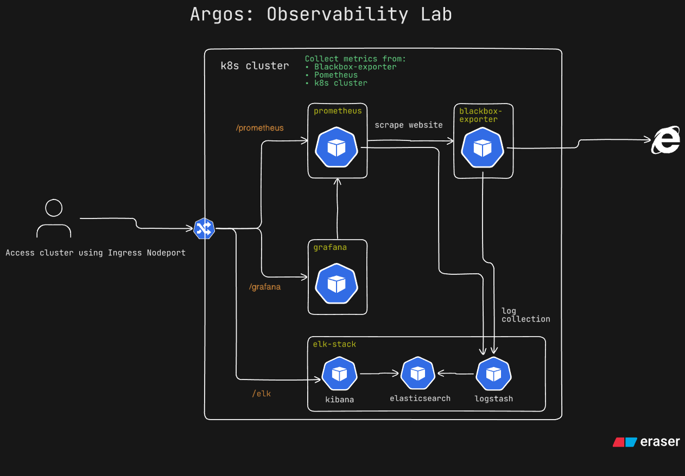

# argos-observability-lab

The project was born out of the need to have a k8s cluster that's as close to an actual cluster as possible that I can run on my Raspberrypi.

Minikube is good for starting but it doesn't really come close to an actual cluster. I tried k3d but that came with it's own set of challenges.

Kind started as good but did have some issues if I went past the two nodes that are currently configured. Even with the lower number of workers, it feels like an actual cluster and allows me to deploy the required components.

Once I did have at least a few components working, I wanted to share the project so here it is!

The following shows up a high level diagram of the cluster as it stands now. As of now the ELK stack is on the todo list(coming soon)



the following minimal config allows you to get a cluster running on a local laptop and get Prometheus and Grafana up and running with some data collection started within minutes.

## Pre Requisites

We need the following to ensure the cluster can run and function as expected:
- Docker
- [kind](https://kind.sigs.k8s.io)
- [kubectl](https://kubernetes.io/docs/tasks/tools/) - Not required but makes it a lot easier to work with the cluster.
- [helm](https://helm.sh/docs/intro/install/) - Optional if you want to install using helm directly
- [terraform](https://developer.hashicorp.com/terraform) - Optional if you want to use terraform to install haproxy

## Start kind Cluster

```bash
kind create cluster --config ./kind-cluster.yaml
```

## Install HAProxy Ingress Controller
### Install HA proxy Ingress controller using Helm

We may use helm to install haproxy ingress and set nodeports to predefined values to make it easier to access services.

```
helm repo add haproxytech https://haproxytech.github.io/helm-charts
helm repo udpate
helm install haproxy-kubernetes-ingress haproxytech/kubernetes-ingress \
  --create-namespace \
  --namespace haproxy-controller \
  --set controller.service.nodePorts.http=30000 \
  --set controller.service.nodePorts.https=30001 \
  --set controller.service.nodePorts.stat=30002 \
  --set controller.service.nodePorts.prometheus=30003
```

### Install Terraform to install HA Proxy Ingress controller

The code for the installation is in the terraform directory

Install using the following commands after changind to the terraform directory.

```bash
terraform init
terraform plan # optional to view output and validate changes
terraform apply
```

## Install Metrics Server

### Install using kubectl

The metrics server provides the neccessary telemetry to work with HPA and may be installed using:

```bash
kubectl apply -f https://github.com/kubernetes-sigs/metrics-server/releases/latest/download/components.yaml
```


## Deploy Promethes

Prometheus is set up with a deployment, a ClusterIP service and an Ingress

Deploy using the following command:

```bash
kubectl apply -f prom/
```
If the pods are started successfully and everything went well you can access the prometheus interface at:

> http://< local or remote host >:30000/prometheus


## Deploy Grafana

Grafana can be installed as a stand alone component using the following command:

```bash
kubectl apply -f grafana/
```

This deploys the pods, service and ingress.

If the pods are started successfully and everything went well you can access the grafana interface at:

> http://< local or remote host >:30000/grafana

If you want to connect Prometheus to Grafana to start visualizing your data you'll have to add the Prometheus data source with the following URL.

> http://prom-internal-service.prometheus:9090/prometheus


## ToDo

The next steps for the project are:

- [ ] Add ELK stack option
- [ ] Add New Relic observability option
- [ ] Add DataDog observability option
- [ ] Add Sample App workload
- [ ] Add API Server workload
- [ ] Add Opentelemetry instrumentation and collector for sample App and API server
- [ ] Add LGTM stack option
- [ ] More

